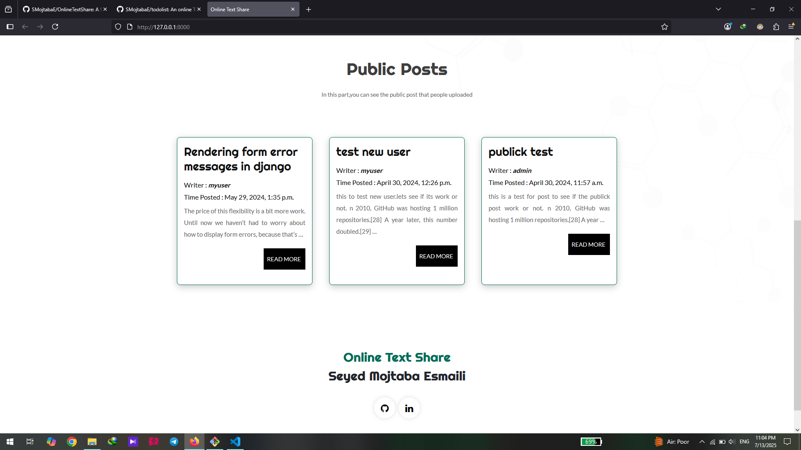

# OnlineTextShare
> An online text share manager with signup and login
# Description

OnlineTextShare is a lightweight web application that allows users to create, share, and manage text snippets effortlessly. Perfect for quick notes, or writing ideas for yourself or others, this platform is designed with simplicity and usability in mind.

# Demo:
### Homepage



### Login page

### User texts List page


## 🚀 Features

- **Instant Text Sharing**: Create and share text snippets with a single click.
- **User Authentication**: Secure your snippets with user accounts.
- **Edit and Delete**: Easily modify or remove your snippets whenever needed.
- **Responsive Design**: Access the platform from any device, whether desktop or mobile.
- **Private or Public**: share text public for all or make it private for yourself.

## Installation:
**1.Clone the Repo**
```sh
git clone https://github.com/SMojtabaE/OnlineTextShare.git
cd /OnlineTextShare
```

**2.Migrate Database**
```sh
python manage.py makemigrations
python manage.py migrate
```
**4.Start Server**
```sh
python manage.py runserver
```
# Contributors
Contributions are welcome, and they are greatly appreciated! Every little bit helps, and credit will always be given.<br/>

Please star the repo and feel free to make pull requests.


